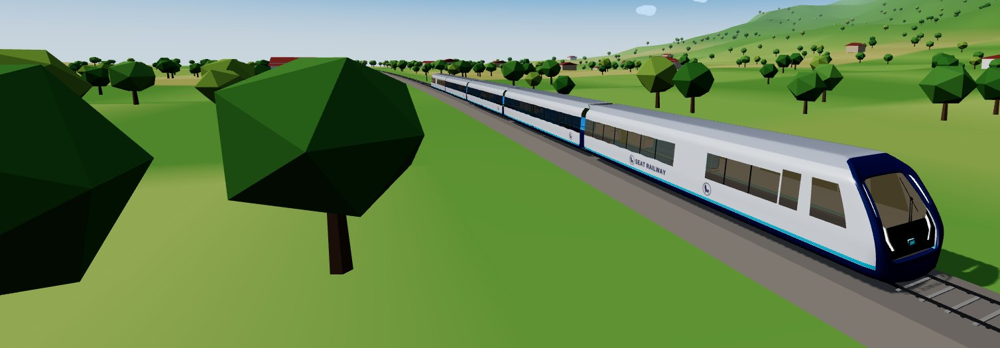
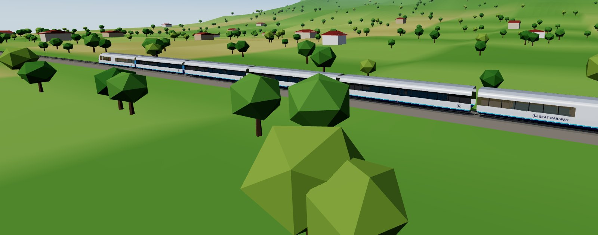
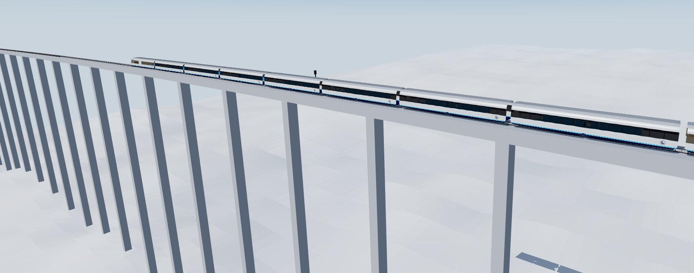
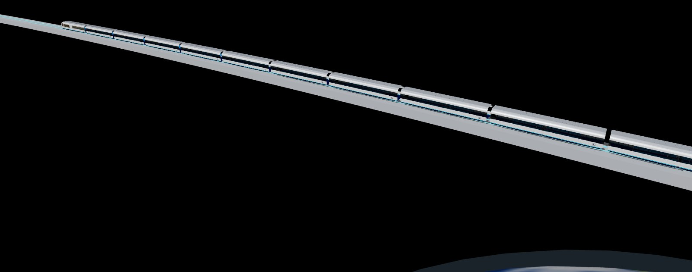
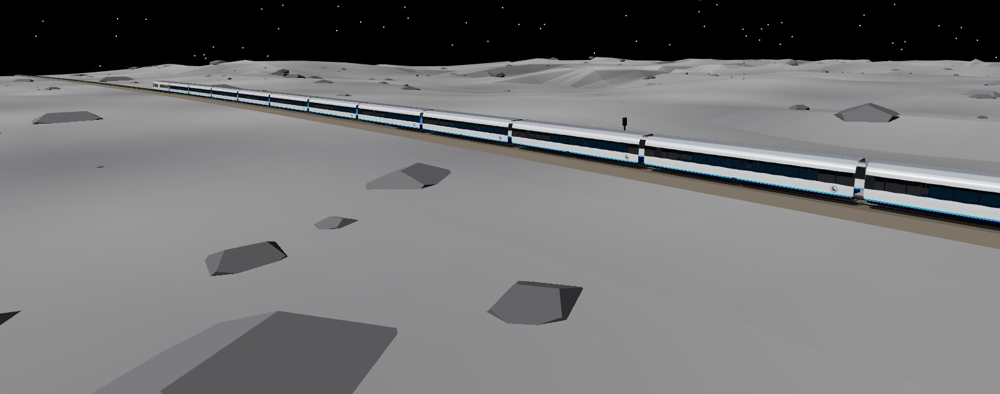
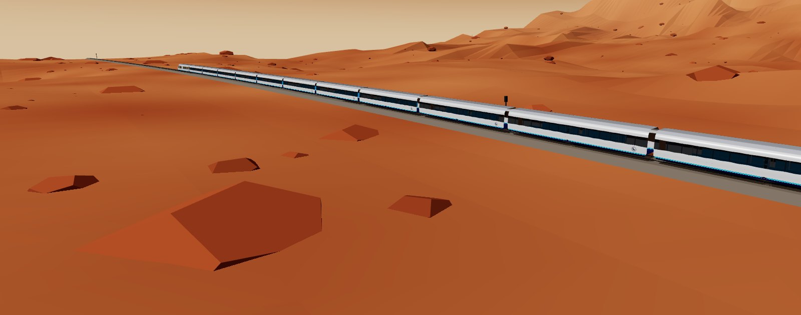
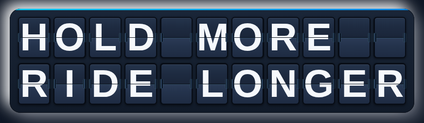
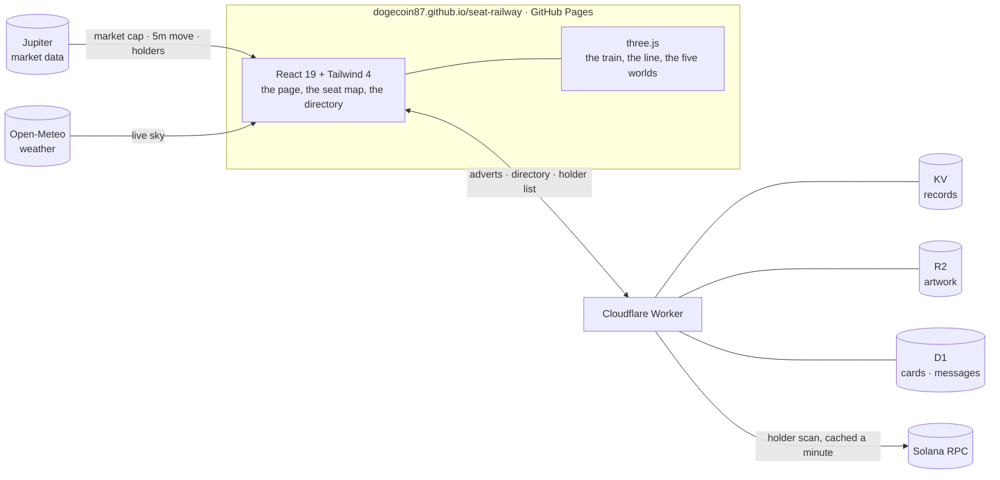

<div align="center">


# SEAT RAILWAY

**One train. Everyone's on it. Your bag is your seat.**

A train run by one number: its length, the line it runs on and the world it runs through are read live from its token's market,<br>
so the train on your screen *is* the chart — and its 178 seats go to the biggest holders, in order.

[](https://dogecoin87.github.io/seat-railway/)
[](docs/README.md)

[](https://github.com/DOGECOIN87/seat-railway/actions/workflows/deploy.yml)
[](LICENSE)



<sub>Train **SR350** · Express · rendered live in the browser</sub>

</div>

---

## Contents

- [The premise](#the-premise)
- [How the train shows the market cap](#how-the-train-shows-the-market-cap)
- [On board](#on-board)
- [Explore the documentation](#explore-the-documentation)
- [For developers](#for-developers) — [architecture](#architecture) · [quick start](#quick-start) · [project structure](#project-structure) · [configuration](#configuration) · [deploying](#deploying)
- [Licence](#licence)

## The premise

| | |
| :-- | :-- |
| **Market cap is the length of the train** | A carriage is coupled on at every 1-2-5 step from $10K — $10K, $20K, $50K, $100K … — up to fourteen at $200M. Fall back under a milestone and a carriage is left behind on the line. |
| **Market cap is where the line goes** | Country under $1M, a viaduct above the clouds at $1M, space at $10M, the moon at $50M, Mars at $100M. |
| **The five-minute move is the grade** | A rising market lays the line ahead uphill, a falling one downhill, so the track behind the train is the chart. |
| **Your bag is your seat** | The 178 biggest holders are seated by rank, driver's cab first. Everyone else rides in the freight car. |
| **Seats are finite** | Out-hold the holder in front of you and you take their seat — and the PA tells the whole train. |
| **Every seat is a billboard** | A seated holder can put a square image on their seat. It moves with them, and goes up on the billboards beside the line. |
| **Your seat is which room you are in** | In the directory you see and reach your own coach, and nobody else's. |

> [!IMPORTANT]
> Seat Railway never asks your wallet to approve a transaction. Every signature it requests is a plain-text message, and [Wallet safety](docs/safety/wallet-safety.md) prints each one word for word.

## How the train shows the market cap

| The market's… | …becomes |
| :-- | :-- |
| Market cap | **Length**: a carriage per milestone, coupling on from behind and uncoupled when lost |
| Market cap | **The cab's display**, and **the world** the line runs through |
| Five-minute change | **The grade** of the line ahead, the **speed**, and the **signals** (green, amber, red) |
| Holder count | **Lit carriages**, front first, and **passengers** on board |
| Milestones | The **horn** when a carriage couples on, the **crossing bell** when one is left behind |

→ [One number runs the train](docs/how-it-runs/one-number-runs-the-train.md) · [How the train shows the market cap](docs/the-railway/market-cap-on-the-train.md)

### The five worlds

<table>
<tr>
<td width="50%" valign="top">


**In the country** · under $1M<br>
<sub>Farmland, forest, snowy mountains, desert and coast, blending one into the next and never repeating. A station every couple of kilometres, billboards in between, and your own sky and weather.</sub>
</td>
<td width="50%" valign="top">


**Above the clouds** · $1M<br>
<sub>The line climbs onto a viaduct, its piers dropping away into a sea of cloud.</sub>
</td>
</tr>
<tr>
<td width="50%" valign="top">


**Space** · $10M<br>
<sub>A guideway through the dark, rails glowing cyan, a planet far below.</sub>
</td>
<td width="50%" valign="top">


**The moon** · $50M<br>
<sub>Craters, boulders and a black sky, with Earth hanging over the horizon.</sub>
</td>
</tr>
<tr>
<td colspan="2" valign="top">


**Mars** · $100M — the furthest out, so far<br>
<sub>Red plains and boulders under a butterscotch sky, with two small moons — and by now thirteen carriages behind the cab.</sub>
</td>
</tr>
</table>

## On board

<table>
<tr>
<td width="50%" valign="top">

### A real train, in 3D

The site opens on the train **full screen**, running through the country, in the Seat livery — navy, cyan and pearl, with the mark and **SEAT RAILWAY** on its flanks and the market cap on the cab's display. Press **Enter** to go in. Inside, the page opens **outside, on the whole train**; drag to walk round it. Step inside to a seat, or walk the train from the driver's cab to the freight car.

The train, the track, the station and the billboards are 3D models, converted for the web in [`public/models`](public/models/README.md).

→ [Views and controls](docs/the-train/views-and-controls.md)

</td>
<td width="50%" valign="top">

### The seat ladder

178 seats across five coaches — **driver's cab, first class, business, exit row, standard** — filled strictly by rank. Your seat is your placement on the wall, the size of your tile, and which coach's directory and room you belong to.

Check in with **Phantom, Solflare, Backpack or Nightly** and your ticket is issued on the spot.

→ [The seat ladder](docs/the-train/seat-ladder.md) · [Coaches and seats](docs/the-train/coaches-and-seats.md)

</td>
</tr>
<tr>
<td width="50%" valign="top">

### The wall, and the line

Every seat is a square, so every held seat is a billboard. Holders put a 1:1 image on the seat they hold, best placements at the front — and the same adverts go up on the billboards beside the line.

→ [Every seat is a billboard](docs/the-wall/every-seat-is-a-billboard.md) · [Proposal: buy trackside ad space with the token](docs/the-railway/billboards-for-the-token.md)

</td>
<td width="50%" valign="top">

### Section network

A holder directory with the train's own manners: publish a card, read your own coach's cards, introduce yourself, talk in your coach's room — and from the driver's cab, one PA announcement a day that the whole train hears.

→ [Your seat is which room you are in](docs/section-network/how-far-you-can-see.md)

</td>
</tr>
</table>

<div align="center">

<br><sub>The site opens on a split-flap departure board, flap by flap — <a href="docs/for-developers/departure-board.md">how it works</a></sub>
</div>

> [!NOTE]
> Seat Railway began as a copy of [Seat Airlines](https://github.com/DOGECOIN87/Seat-Airlines). The inside views (seat, driver's cab, freight car) still use the airline's 3D interiors, and the **Connect & fly** side game on the landing still flies the airline's plane.

## Explore the documentation

The full guide is the [`docs/`](docs/README.md) folder of this repository, laid out for GitBook (`gitbook-docs.yaml`) whenever it is connected.

<table>
<tr>
<td width="25%" valign="top">

**Getting started**

- [Quick start](docs/getting-started/quick-start.md)
- [The token](docs/getting-started/the-token.md)
- [Connecting a wallet](docs/getting-started/connecting-a-wallet.md)

</td>
<td width="25%" valign="top">

**How it runs**

- [One number runs the train](docs/how-it-runs/one-number-runs-the-train.md)
- [The five worlds](docs/how-it-runs/the-five-worlds.md)
- [The lamps and the PA](docs/how-it-runs/lamps-and-the-pa.md)
- [The sky outside](docs/how-it-runs/the-sky.md)

</td>
<td width="25%" valign="top">

**The train**

- [The seat ladder](docs/the-train/seat-ladder.md)
- [Coaches and seats](docs/the-train/coaches-and-seats.md)
- [Views and controls](docs/the-train/views-and-controls.md)
- [Your ticket](docs/the-train/your-ticket.md)

</td>
<td width="25%" valign="top">

**The railway & the wall**

- [How the train shows the market cap](docs/the-railway/market-cap-on-the-train.md)
- [Buy trackside ad space (proposal)](docs/the-railway/billboards-for-the-token.md)
- [Every seat is a billboard](docs/the-wall/every-seat-is-a-billboard.md)
- [Put an advert on your seat](docs/the-wall/put-an-advert-on-your-seat.md)

</td>
</tr>
<tr>
<td valign="top">

**Section network**

- [Your seat is which room you are in](docs/section-network/how-far-you-can-see.md)
- [Cards and sign-in](docs/section-network/cards-and-sign-in.md)
- [Introductions, rooms and the PA](docs/section-network/introductions-rooms-and-the-pa.md)

</td>
<td valign="top">

**Safety & help**

- [Wallet safety](docs/safety/wallet-safety.md)
- [FAQ](docs/help/faq.md)

</td>
<td colspan="2" valign="top">

**For developers**

- [How it is built](docs/for-developers/how-it-is-built.md) · [Engineering notes](docs/for-developers/engineering-notes.md)
- [Run it locally](docs/for-developers/run-it-locally.md) · [Configuration](docs/for-developers/configuration.md)
- [Worker API](docs/for-developers/worker-api.md) · [Deploying](docs/for-developers/deploying.md)
- [The departure board](docs/for-developers/departure-board.md)

</td>
</tr>
</table>

---

## For developers

<p>


</p>

### Architecture

The page is a static single-page app on GitHub Pages. Anything that has to be shared between visitors — adverts, the directory, the holder list — lives in one Cloudflare Worker, which holds the RPC key so no browser ever has to.



The train is built in [`src/three/RailWorld.ts`](src/three/RailWorld.ts) and sized by the pure functions in [`src/lib/consist.ts`](src/lib/consist.ts). The seat ladder lives in [`src/lib/seating.ts`](src/lib/seating.ts) — no browser and no Cloudflare in it — and the page and the Worker import the same file, so they cannot disagree about who sits where. → [How it is built](docs/for-developers/how-it-is-built.md) · [Engineering notes](docs/for-developers/engineering-notes.md)

> [!WARNING]
> **The Worker is shared with Seat Airlines for now**, and so is the token: the committed build reads `seat-airlines-banners.trashmarket.workers.dev`. That Worker only answers origins in its `ALLOWED_ORIGINS`, so until this site's origin is added there, the published railway shows the train and the market but no seats, adverts or directory. For a token of its own, deploy `worker/` under a new name and set `VITE_BANNERS_API`. → [Deploying](docs/for-developers/deploying.md)

### Quick start

Requires **Node 22**.

```bash
npm install
npm run dev          # http://localhost:3000
npm test             # the page's unit suites
npm run build        # typecheck, then bundle to dist/
```

To run the Worker locally too — Miniflare, with simulated KV, R2 and D1 — see [Run it locally](docs/for-developers/run-it-locally.md) and the [Worker's README](worker/README.md).

### Project structure

```
├── src/
│   ├── App.tsx              the landing, then the page: the view, its section panels
│   ├── components/          views, the seat map, the directory, the departure board
│   ├── three/               the 3D worlds: RailWorld.ts (the train and the line), and the interiors
│   ├── lib/                 consist (carriages, grade), market feed, seating, wallet, directory client
│   └── content/cabin.ts     the coaches' layout and copy
├── public/
│   ├── models/              the train, track, station and billboard (GLB)
│   └── rail/                the track loop, horns and crossing bell
├── worker/                  the Cloudflare Worker: adverts, directory, holders
├── docs/                    the documentation (GitBook-ready)
├── scripts/models/          how the models were converted
├── test/                    unit suites for the page
└── gitbook-docs.yaml        the GitBook site contract
```

### Configuration

Every setting is optional, and every `VITE_` value is **public** — Vite writes it into the bundle — so they are repository *variables*, never secrets.

| Variable | What it does |
| :-- | :-- |
| `VITE_TOKEN_MINT` | The token the train reads; overrides the committed address |
| `VITE_BANNERS_API` | The Worker: the advert wall, and by default everything else |
| `VITE_HOLDERS_URL` | An indexer for the holder list, if you have one |
| `VITE_DOCS_URL` | Where the **Docs** link goes (today: the `docs/` folder on GitHub) |

> [!WARNING]
> Leave `VITE_RPC_URL` unset in production. Its URL — key and all — would ship to every visitor. The Worker holds the RPC endpoint as a secret instead.

The full list, and the Worker's bindings and secrets: [Configuration](docs/for-developers/configuration.md).

### Deploying

| What | How |
| :-- | :-- |
| **The page** | Every push to `main` runs the tests, builds and publishes to GitHub Pages at [dogecoin87.github.io/seat-railway](https://dogecoin87.github.io/seat-railway/) — once Pages is turned on (**Settings → Pages → Source: GitHub Actions**). |
| **The Worker** | Pushes that touch `worker/` type-check, test and deploy it — when the repository has a `CLOUDFLARE_API_TOKEN` secret. Give the railway's Worker a name of its own first, so it cannot replace Seat Airlines'. |
| **A new token** | `npm run token:update -- <new CA>`: checks on-chain that it is a token mint, writes it everywhere it is printed (page, Worker, `index.html`, docs), runs the tests and a build, and pushes. `--no-push` stops before committing. |

Step by step, including a custom domain: [Deploying](docs/for-developers/deploying.md).

## Licence

[MIT](LICENSE) © 2026 Matt Mobley

<div align="center">
<br>
<sub><b>SEAT RAILWAY</b> · Train SR350 · Express · <i>Hold more. Ride longer.</i></sub>
</div>
